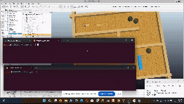

# Navigation: Nodo de Navegación Reactiva en ROS 2

Este paquete de ROS 2 implementa un sistema de **navegación reactiva en tiempo real** para una plataforma robótica móvil (`reactive`). El sistema procesa de forma dinámica las lecturas de un sensor de rango (LiDAR) para calcular trayectorias libres de obstáculos mediante un algoritmo adaptativo de búsqueda de huecos (*Gap Finding*), ponderación de sectores y un lazo de control cerrado mediante un controlador PID integrado con una Máquina de Estados Finitos (FSM).





## 🚀 Arquitectura del Sistema (Grafo de ROS 2)

El nodo computacional principal se denomina `reactive` y establece las siguientes interfaces de comunicación con el ecosistema del robot:

* **Suscripciones:**
    * `/laser_scan` (`sensor_msgs/msg/LaserScan`): Suscripción al flujo de datos del LiDAR para la detección del entorno en un rango angular de hasta $240^\circ$ (dividido en sectores de cobertura).
* **Publicaciones:**
    * `/cmd_vel` (`geometry_msgs/msg/Twist`): Publicación periódica de las consignas de velocidad lineal (`linear.x`) y velocidad angular (`angular.z`) hacia los actuadores del robot.
* **Servicios Servidores:**
    * `power_on_off` (`navigation/srv/Power`): Interfaz de servicio personalizada que permite inicializar o detener por completo la lógica de navegación de forma remota a través de comandos secuenciales (`power on` / `power off`).

---

## 🛠️ Lógica de Control y Algoritmos

El núcleo del nodo implementa una estrategia de guiado distribuida en tres fases secuenciales ejecutadas de forma síncrona a una frecuencia fija de **5 Hz**:

### 1. Procesamiento y Ponderación Triangular del Láser
El escaneo láser se segmenta dinámicamente en tres regiones angulares críticas para evaluar la densidad de obstáculos:
* **Sector Central (Frente):** de $-40^\circ$ a $+40^\circ$ (Umbral de proximidad de seguridad: $1.6\text{ m}$).
* **Sector Derecho:** de $-120^\circ$ a $-40^\circ$ (Umbral de proximidad de seguridad: $1.2\text{ m}$).
* **Sector Izquierdo:** de $+40^\circ$ a $+120^\circ$ (Umbral de proximidad de seguridad: $1.2\text{ m}$).

Para optimizar la toma de decisiones, la función de asignación de pesos (`weight_assignation`) aplica un **perfil de ponderación triangular** sobre las distancias leídas. Esto altera artificialmente las distancias según la posición del haz para penalizar los obstáculos frontales y suavizar los laterales, garantizando transiciones de giro progresivas. En caso de bloqueo total simultáneo de los tres sectores, se activa el flag global de seguridad `no_free_space`.

### 2. Algoritmo de Búsqueda de Huecos (Gap Finding)
La función `orientation_calculation` discrimina cuál es el sector óptimo comparando los perfiles de distancia acumulada acumulados. Una vez seleccionado el sector de preferencia (priorizando avanzar recto si el frente está despejado), el algoritmo realiza un barrido interno dividiendo el sector en tercios mediante una ventana móvil integrada por **conos de 10 lecturas**. Aquella ventana que maximice el promedio de distancia libre es seleccionada, deduciendo el ángulo objetivo exacto (`desired_orientation`).

### 3. Máquina de Estados Finitos (FSM) de Seguridad
El comportamiento del robot se supervisa continuamente bajo una FSM que previene colisiones inminentes:

    +------------------------+  Obstáculo Frontal <= 1.6m  +---------------------+
    |                        | --------------------------> |                     |
    |    NORMAL_OPERATION    |                             | INMINENT_COLLISION  |
    |                        | <-------------------------- |                     |
    +------------------------+   Sector Frontal Despejado  +---------------------+

* **`NORMAL_OPERATION`:** El robot navega a su velocidad nominal base de 1.2 m/s. Si se requiere un giro pronunciado (error angular > 60°), la velocidad lineal se atenúa automáticamente al 40% para garantizar la estabilidad cinemática.
* **`INMINENT_COLLISION`:** Activado ante intrusiones críticas en el sector frontal. Reduce de forma drástica la velocidad lineal al 10% para minimizar el impacto o permitir maniobras de evasión de emergencia. Si el entorno se encuentra completamente bloqueado (`no_free_space`), el avance lineal se anula por completo (0.0 m/s) y se fuerza un régimen de giro de recuperación de -0.9 rad/s para pivotar sobre su propio eje.

### 4. Bucle de Control PID Angular
La orientación deseada alimenta de forma directa el error de un controlador secundario que calcula la velocidad angular final (w):
* **Ganancias del Lazo:** Kp = 1.5, Ki = 0.0, Kd = 0.5.
* **Mecanismo Anti-Windup:** La acción integral se satura y se reinicia de manera inmediata si el error angular decae por debajo de un umbral de zona muerta (< 0.1 rad) o si ocurre un cruce por cero (cambio de signo en el error), evitando sobreoscilaciones destructivas en la respuesta temporal.

* **NOTA:** En este caso, no hay Ki porque lo importante es que el robot apunte a un cono de orientaciones, no a una orientación exacta en concreto.

---

## 📂 Estructura del Repositorio

El espacio de trabajo se distribuye bajo el estándar estricto de desarrollo de paquetes de ROS 2:

* `CMakeLists.txt`: Reglas de compilación en CMake y exportación a ament.
* `package.xml`: Metadatos del paquete y especificación de dependencias.
* `README.md`: Documentación técnica principal.
* `include/navigation/reactive.hpp`: Definición de la clase del nodo, constantes y tipos de datos.
* `launch/reactive_launch.xml`: Archivo Launch para despliegue automatizado del nodo.
* `src/reactive.cpp`: Implementación de los callbacks, algoritmos y bucle de control.
* `srv/Power.srv`: Definición de la interfaz del servicio personalizado de encendido.

---

## 🔧 Instalación y Despliegue

### Requisitos Previos
* Instalación activa de **ROS 2 (Humble / Iron / Jazzy)**.
* Ecosistema de compilación `colcon`.

### Compilación del Paquete
Clona este repositorio dentro de la carpeta fuente (`src`) de tu Workspace de ROS 2 y ejecuta la compilación selectiva:

```bash
# Navegar al directorio raíz del workspace
cd ~/ros2_ws/

# Compilar el paquete navigation
colcon build --packages-select navigation

# Recargar las variables del entorno
source install/setup.bash
```

### Ejecución del Nodo
Para lanzar el nodo de navegación reactiva junto con sus parámetros por defecto, utiliza el archivo launch:

```bash
ros2 launch navigation reactive_launch.xml
```

Para activar el movimiento de la plataforma, realiza una llamada al servicio desde otra terminal:

```bash
ros2 service call /power_on_off navigation/srv/Power "{power_command: 'power on'}"
```

